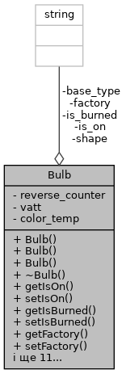

# Лабораторна робота №17. ООП. Вступ до ООП

## 1. Вимоги

### 1.1 Розробник

* Хелемендик Дмитро Олегович;
* студент групи КН-921д;
* 09-трав-2022.

### 1.2 Загальне завдання

Для предметної галузі з розділу “Розрахункове завдання / Iндивідуальні завдання” розробити два класи:
• клас, що відображає сутність “базового класу”, у тому числі:
	– конструктор за замовчуванням, копіювання та конструктор з аргументами (реалізація конструкторів повинна бути продемонстрована за допомогою списків ініціалізацій);
	– деструктор;
	– гетери та сетери на поля класу;
	– метод виводу об’єкта на екран:
• клас, що має у собі динамічний масив об’єктів базового класу та має в собі методи додавання, видалення елемента, отримання елемента по індексу (або ідентифікатору), вивід усіх елементів на екран.
	– метод 1 обходу колекції.

## 2. Опис програми

### 2.1 Функціональне призначення

Програма призначена для додавання, видалення лампочок, знаходження згорівших лампочок та отримання лампочки за індексом. Програма працює за допомогою функцій, що задекларовані в *entity.h*, *list.h*, *iostream* та *cstring*.

Результат зберігається у змінній *list*.

Демонстрація знайдених результатів передбачає виконання програми у вікні консолі.

### 2.2 Опис логічної структури

За допомогою ключового слова *class* описуємо лампочку, що має 8 полів – чи ввімкнена лампочка, чи перегоріла лампочка, виробник, зворотній лічильник, ватти, температура колбору світіння, форма, тип цоколю. Розроблено структуру, вміст якої подано нижче. А також методами: конструктор(конструктор за замовчування, з аргументами та конструктор копіювання), деструктор, гетери, сетери та вивод лампочки на екран.



Також описуємо структуру контейнера, що має два приватних поля - лампочки та їх кількість. Також має публічні методи: додавання, видалення елементів, отримання лампочки за індексом, знаходження згорівшої лампочки та вивод списку на екран.


Опис розроблених структур і функцій наводиться на базі результатів роботи системи автодокументування *Doxygen*.

#### Функція додавання лампочки у список

```
	void List::addBulb(const Bulb &bulb, size_t pos = 0);
```

*Призначення*: додавання лампочки у список.

*Опис роботи*: функція виділяє пам'ять для більшого масива, переписує в нього старі лампочки(якщо вони є) та додає нову лампочку в задану позицію.

**Аргументи**:

- *bulb* - лампочка для додавання;
- *pos* - позиція для додавання.

#### Функція видалення лампочки зі списку

```
	void List::removeBulb(size_t pos);
```

*Призначення*: видалення лампочки зі списку.

*Опис роботи*: функція видаляє лампочку зі списку шляхом виділення пам'яті для меншого масива та заповненням в нього всіх елементів окрім лампочки для видалення.

**Аргументи**:

- *pos* - позиція для видалення.

#### Функція отримання лампочки за індексом

```
	Bulb &List::getBulb(size_t index);
```

*Призначення*: отримання лампочки зі списку.

*Опис роботи*: функція повертає силку на лампочку за певним індексом.

**Аргументи**:

- *index* - індекс лампочки, яку потрібно отримати.

#### Функція виводу списку

```
	void List::print() const;
```

*Призначення*: друк списку на екран.

*Опис роботи*: функція друкує список на екран.

#### Функція знаходження згорівших лампочок

```
	void List::findBurnedBulbs() const
```

*Призначення*: знаходження згорівших лампочок.

*Опис роботи*: функція перевіряє чи є лампочки взагалі, якщо є - перевіряє на наявність згорівшої лампочки, та при наявності хоча б однієї згорівшої лампочки - друкує її.

#### Основна функція

```
	int main() 
```

*Призначення*: головна функція.

*Опис роботи*: 

 - створюю 3 лампочки, використовуючи 3 реалізованних конструкторів, та створюю список;
 - далі додаю лампочки в список 4 рази у різні позиції шляхом виклику функції addBulb та друкую їх функцією print;
 - потім видаляю лампочку за індексом 2 за допомогою функції removeBulb та показую результат функцією print;
 - також знаходю згорівші лампочки за допомогою функції findBurnedBulb;
 - нарешті створюю лампочку та заповнюю її даними елемента списку за індексом 1 функцією getBulb та друкую її за допомогою функції print;
 - успішний код повернення з програми (0).

### Структура проекту:

```
     └── lab17
	├── doc
	│   ├── assets
	│   │   └── bulb_fields.png
	│   │   └── list_fields.png
	│   ├── lab17.docx
	│   └── lab17.md
	│   └── lab17.pdf
	├── Doxyfile
	├── Makefile
	├── README.md
	├── src
	│   ├── list.cpp
	│   ├── list.h
	│   ├── entity.cpp
	│   ├── entity.h
	│   └── main.cpp
	└── test
	    └── test.cpp
```

### 2.3 Важливі фрагменти програми

#### Додавання лампочки до списку

```
	// memory allocation
	Bulb **new_bulbs = new Bulb *[size + 1];
	if (pos > size)
		pos = size;
	// writting to the dynamic array
	for (size_t i = 0; i < pos; i++) {
		new_bulbs[i] = bulbs[i];
	}
	new_bulbs[pos] = new Bulb(bulb);
	for (size_t i = pos; i < size; i++) {
		new_bulbs[i + 1] = bulbs[i];
	}
	delete[] bulbs;
	bulbs = new_bulbs;
	size++;
```

#### Видалення лампочки зі списка

```
	if (size == 0)
		return;
	Bulb **new_bulbs = new Bulb *[size - 1];
	if (pos >= size)
		pos = size - 1;
	for (size_t i = 0; i < pos; i++) {
		new_bulbs[i] = bulbs[i];
	}
	for (size_t i = pos; i < size - 1; i++) {
		new_bulbs[i] = bulbs[i + 1];
	}
	delete bulbs[pos];
	delete[] bulbs;
	bulbs = new_bulbs;
	size--;
```

## 3. Варіанти використання

Для демонстрації результатів кожної задачі використовується:

- виконання програми у вікні консолі.

**Варіант використання 1**: запуск програми у вікні консолі:

- запустити програму у консолі;
- подивитись результат програми.

```
	dima@dima-VirtualBox:~/dev/programing-khelemendyk-cpp/lab17$ ./dist/main.bin 
	Adding bulbs and print them
	Bulb 1: no, yes, Romashka, 21, 15, 2400, Triangle, E21.
	Bulb 2: yes, no, TOV Roga and kopyta, 100, 5, 1800, Circle, E40.
	Bulb 3: no, yes, Romashka, 21, 15, 2400, Triangle, E21.
	Bulb 4: yes, no, TOV Roga and kopyta, 100, 5, 1800, Circle, E40.

	Removing bulb
	Bulb 1: no, yes, Romashka, 21, 15, 2400, Triangle, E21.
	Bulb 2: yes, no, TOV Roga and kopyta, 100, 5, 1800, Circle, E40.
	Bulb 3: yes, no, TOV Roga and kopyta, 100, 5, 1800, Circle, E40.

	Burnt out bulb(s):
	Bulb 1: no, yes, Romashka, 21, 15, 2400, Triangle, E21.

	Getting bulb number 2 and print it
	yes, no, TOV Roga and kopyta, 100, 5, 1800, Circle, E40.

```

## Висновки

При виконанні даної лабораторної роботи було набуто практичного досвіду у роботі з ООП.
