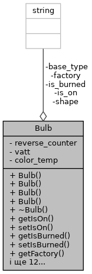

# Лабораторна робота №18. ООП. Потоки

## 1. Вимоги

### 1.1 Розробник

* Хелемендик Дмитро Олегович;
* студент групи КН-921д;
* 12-трав-2022.

### 1.2 Загальне завдання

Поширити попередню лабораторну роботу таким чином:
 • замінити метод виводу інформації про об’єкт на метод, що повертає рядок-інформацію про об’єкт, який далі можна виводити на екран;
 • замінити метод вводу інформації про об’єкт на метод, що приймає рядок з інформацією про об’єкт, обробляє його та створює об’єкт на базі цієї інформації;
 • поширити клас-список, шляхом реалізації методів роботи з файлами за допомогою файлових потоків (fstream) (читання та запис).

## 2. Опис програми

### 2.1 Функціональне призначення

Програма призначена для додавання, видалення лампочок, знаходження згорівших лампочок та отримання лампочки за індексом, читання з файла та запис результатів у файл. Програма працює за допомогою функцій, що задекларовані в *entity.h*, *list.h*, *iostream*, *sstream*, *fstream*, *cctype* та *cstring*.

Результат зберігається у змінній *list*.

Демонстрація знайдених результатів передбачає виконання програми у вікні консолі.

### 2.2 Опис логічної структури

За допомогою ключового слова *class* описуємо лампочку, що має 8 полів – чи ввімкнена лампочка, чи перегоріла лампочка, виробник, зворотній лічильник, ватти, температура колбору світіння, форма, тип цоколю. Розроблено структуру, вміст якої подано нижче. А також методами: конструктор(конструктор за замовчування, з аргументами, конструктор з строкою та конструктор копіювання), деструктор, гетери, сетери та створення рядка-інформацію.



Також описуємо структуру контейнера, що має два приватних поля - лампочки та їх кількість. Також має публічні методи: додавання, видалення елементів, отримання лампочки за індексом, знаходження згорівшої лампочки, вивод списку на екран, читання даних з файла та запис результатів у файл.


Опис розроблених структур і функцій наводиться на базі результатів роботи системи автодокументування *Doxygen*.

#### Функція отримання рядка-інформації

```
	void Bulb::string toString();
```

*Призначення*: отримання рядка-інформації.

*Опис роботи*: функція створює рядок-інформацію про об'єкт з наявних даних та повертає ссилку на рядок.

#### Функція читання файла

```
	void List::readFromFile(string &fileName);
```

*Призначення*: читання даних з файла.

*Опис роботи*: функція обнуляє список, зчитує дані з файла та записує їх у список. Отримує адрес файла.

**Аргументи**:

- *fileName* - адрес файла;

#### Функція запису у файл

```
	void List::writeToFile(string &fileName);
```

*Призначення*: запис даних у файл.

*Опис роботи*: функція записує у файл весь список.

**Аргументи**:

- *fileName* - адрес файла;

#### Функція додавання лампочки у список

```
	void List::addBulb(const Bulb &bulb, size_t pos = 0);
```

*Призначення*: додавання лампочки у список.

*Опис роботи*: функція виділяє пам'ять для більшого масива, переписує в нього старі лампочки(якщо вони є) та додає нову лампочку в задану позицію.

**Аргументи**:

- *bulb* - лампочка для додавання;
- *pos* - позиція для додавання.

#### Функція видалення лампочки зі списку

```
	void List::removeBulb(size_t pos);
```

*Призначення*: видалення лампочки зі списку.

*Опис роботи*: функція видаляє лампочку зі списку шляхом виділення пам'яті для меншого масива та заповненням в нього всіх елементів окрім лампочки для видалення.

**Аргументи**:

- *pos* - позиція для видалення.

#### Функція отримання лампочки за індексом

```
	Bulb &List::getBulb(size_t index);
```

*Призначення*: отримання лампочки зі списку.

*Опис роботи*: функція повертає силку на лампочку за певним індексом.

**Аргументи**:

- *index* - індекс лампочки, яку потрібно отримати.

#### Функція виводу списку

```
	void List::print() const;
```

*Призначення*: друк списку на екран.

*Опис роботи*: функція друкує список на екран.

#### Функція знаходження згорівших лампочок

```
	void List::findBurnedBulbs() const
```

*Призначення*: знаходження згорівших лампочок.

*Опис роботи*: функція перевіряє чи є лампочки взагалі, якщо є - перевіряє на наявність згорівшої лампочки, та при наявності хоча б однієї згорівшої лампочки - друкує її.

#### Основна функція

```
	int main() 
```

*Призначення*: головна функція.

*Опис роботи*: 

 - створюю 4 лампочки, використовуючи 4 реалізованних конструктора;
 - друкую четверту лампочку шляхом виклику функції toString;
 - далі створюю список та додаю в нього ці лампочки 
 функцією addBulb та друкую його за допомогою print;
 - потім створюю дві строки: одна з адресом файла, котрий потрібно 
 зчитати, інша - з адресом файла для запису даних; 
 - тепер зчитую дані з файла шляхом виклику функції readFromFile;
 - нарешті, записую дані у файл функцією writeToFile;
 - успішний код повернення з програми (0).

### Структура проекту:

```
     └── lab18
	├── assets
	│   ├── input.txt
	│   └── output.txt
	├── doc
	│   ├── assets
	│   │   └── bulb_fields.png
	│   │   └── list_fields.png
	│   ├── lab18.docx
	│   └── lab18.md
	│   └── lab18.pdf
	├── Doxyfile
	├── Makefile
	├── README.md
	├── src
	│   ├── list.cpp
	│   ├── list.h
	│   ├── entity.cpp
	│   ├── entity.h
	│   └── main.cpp
	└── test
	    └── test.cpp
```

### 2.3 Важливі фрагменти програми

#### Конструктор з строкою

```
	string temp;
	int mode = 0;
	size_t i = 0;
	// clear spaces before first letter or number
	while (!(isalnum(s[i]))) {
		i++;
	}
	for (; i < s.size(); i++) {
		if ((mode == 2) && !(ispunct(s[i]))) {
			temp += s[i];
		} else if (!(ispunct(s[i])) && s[i] != ' ') {
			temp += s[i];
		} else {
			// writting to object
			if (mode == 0) {
				is_on = temp;
			} else if (mode == 1) {
				is_burned = temp;
			} else if (mode == 2) {
				size_t j = temp.size(); // end of string
				size_t index = 0; // number of spaces
				// removing spaces after words in string
				while (temp[j - 1] == ' ') {
					j--;
					index++;
				}
				// writting to the variable factory
				if (index != 0) {
					factory = temp.substr(0, (temp.size() - index));
				} else {
					factory = temp;
				}
			} else if (mode == 3) {
				reverse_counter = stoi(temp);
			} else if (mode == 4) {
				vatt = stoi(temp);
			} else if (mode == 5) {
				color_temp = stoi(temp);
			} else if (mode == 6) {
				shape = temp;
			} else {
				base_type = temp;
				break;
			}
			// if before next part of string is spaces
			while (!(isalnum(s[i]))) {
				i++;
			}
			i--;
			mode++;
			temp.clear();
		}
	}
```

#### Додавання лампочки до списку

```
	// memory allocation
	Bulb **new_bulbs = new Bulb *[size + 1];
	if (pos > size)
		pos = size;
	// writting to the dynamic array
	for (size_t i = 0; i < pos; i++) {
		new_bulbs[i] = bulbs[i];
	}
	new_bulbs[pos] = new Bulb(bulb);
	for (size_t i = pos; i < size; i++) {
		new_bulbs[i + 1] = bulbs[i];
	}
	delete[] bulbs;
	bulbs = new_bulbs;
	size++;
```

#### Видалення лампочки зі списка

```
	if (size == 0)
		return;
	Bulb **new_bulbs = new Bulb *[size - 1];
	if (pos >= size)
		pos = size - 1;
	for (size_t i = 0; i < pos; i++) {
		new_bulbs[i] = bulbs[i];
	}
	for (size_t i = pos; i < size - 1; i++) {
		new_bulbs[i] = bulbs[i + 1];
	}
	delete bulbs[pos];
	delete[] bulbs;
	bulbs = new_bulbs;
	size--;
```

## 3. Варіанти використання

Для демонстрації результатів кожної задачі використовується:

- виконання програми у вікні консолі.

**Варіант використання 1**: запуск програми у вікні консолі:

- запустити програму у консолі;
- подивитись результат програми;
- також дані зберігаються в output.txt.

```
dima@dima-VirtualBox:~/dev/programing-khelemendyk-cpp/lab18$ ./dist/main.bin 
Printing bulb4
Bulb 4: yes, no, TOV Pont, 33, 10, 3600, quad, E42.

Adding 4 bulbs and printing them
Bulb 1: yes, no, TOV Roga and kopyta, 100, 5, 1800, Circle, E40.
Bulb 2: no, yes, Romashka, 21, 15, 2400, Triangle, E21.
Bulb 3: yes, no, TOV Roga and kopyta, 100, 5, 1800, Circle, E40.
Bulb 4: yes, no, TOV Pont, 33, 10, 3600, quad, E42.

```

## Висновки

При виконанні даної лабораторної роботи було набуто практичного досвіду у роботі з потоками.
