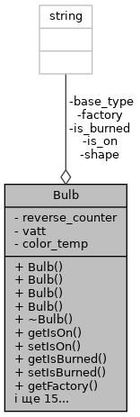

# Лабораторна робота №19. ООП. Перевантаження операторів
## 1. Вимоги

### 1.1 Розробник

* Хелемендик Дмитро Олегович;
* студент групи КН-921д;
* 14-трав-2022.

### 1.2 Загальне завдання

Поширити попередню лабораторну роботу (потоковий i/o при роботі зі класами) таким чином:
 • у базовому класі (прикладної галузі) перевантажити:
		– оператор присвоювання;
 		– оператор порівняння (на вибір 2 протележних оператора: == , != ; < , >= ; > , <= );
 		– оператори введення / виведення;
 • у класі-списку перевантажити:
 		– оператор індексування ( [ ] );
 		– оператори введення / виведення з акцентом роботи, у тому числі і з файлами.

## 2. Опис програми

### 2.1 Функціональне призначення

Програма призначена для додавання, видалення лампочок, знаходження згорівших лампочок та отримання лампочки за індексом, читання з файла та запис результатів у файл. Програма працює за допомогою функцій, що задекларовані в *entity.h*, *list.h*, *iostream*, *sstream*, *fstream*, *cctype* та *cstring*.

Результат зберігається у змінній *list*.

Демонстрація знайдених результатів передбачає виконання програми у вікні консолі.

### 2.2 Опис логічної структури

За допомогою ключового слова *class* описуємо лампочку, що має 8 полів – чи ввімкнена лампочка, чи перегоріла лампочка, виробник, зворотній лічильник, ватти, температура колбору світіння, форма, тип цоколю. Розроблено структуру, вміст якої подано нижче. А також методами: конструктор(конструктор за замовчування, з аргументами, конструктор з строкою та конструктор копіювання), деструктор, гетери, сетери, створення рядка-інформацію, оператори присвоювання, порівняння(==, !=), введення/виведення.



Також описуємо структуру контейнера, що має два приватних поля - лампочки та їх кількість. Також має публічні методи: додавання, видалення елементів, отримання лампочки за індексом, знаходження згорівшої лампочки, вивод списку на екран, читання даних з файла, запис результатів у файл, оператор індексування, оператор введення/виведення.


Опис розроблених структур і функцій наводиться на базі результатів роботи системи автодокументування *Doxygen*.

#### Оператор присвоювання лампочки

```
	Bulb &operator=(const Bulb &bulb);
```

*Призначення*: присвоєння значення однієї лампочки іншій.

*Опис роботи*: функція присвоює одній лампочці всі дані іншої лампочки. 

**Аргументи**:

- *bulb* - константне посилання на лампочку.

#### Оператор порівняння лампочки

```
	bool operator==(const Bulb &bulb) const;
```

*Призначення*: порівняти дві лампочки.

*Опис роботи*: функція порівнює чи однакові всі дані однієї лампочки з даними іншої. Повертає 1 якщо лампочки однакові, інакше - 0.

**Аргументи**:

- *bulb* - константне посилання на лампочку.

#### Оператор порівняння лампочки

```
	bool operator!=(const Bulb &bulb) const;
```

*Призначення*: порівняти дві лампочки.

*Опис роботи*: функція порівнює чи ні рівні всі дані однієї лампочки з даними іншої.Повертає 1 якщо лампочки однакові, інакше - 0.

**Аргументи**:

- *bulb* - константне посилання на лампочку;

#### Оператор виводу лампочки

```
	friend ostream &operator<<(ostream &output, const Bulb &d);
```

*Призначення*: виведення лампочки на екран.

*Опис роботи*: функція виводить всі змінні лампочки через кому.

**Аргументи**:

- *output* - оператор виводу;
- *bulb* - константне посилання на лампочку.

#### Оператор вводу лампочки

```
	friend istream &operator>>(istream &input, Bulb &d);
```

*Призначення*: виведення лампочки на екран.

*Опис роботи*: функція запитує у користувача дані та записує їх у об'єкт.

**Аргументи**:

- *input* - оператор вводу;
- *bulb* - константне посилання на лампочку;

#### Оператор індексації списку

```
	Bulb &operator[](size_t i) const;
```

*Призначення*: отримання лампочки за індексом.

*Опис роботи*: функція повертає лампочку по індексу зі списка.

**Аргументи**:

- *і* - індекс лампочки.

#### Оператор виводу списку на екран

```
	friend ostream &operator<<(ostream &output, const List &l);
```

*Призначення*: виведення всіх лампочок на екран.

*Опис роботи*: функція виводить всі лампочки через кому.

**Аргументи**:

- *output* - оператор виводу;
- *l* - посилання на список.

#### Оператор вводу данних у список

```
	friend istream &operator>>(istream &input, List &l);
```

*Призначення*: заповнення списку.

*Опис роботи*: функція запитує у користувача дані та записує їх у об'єкт.

**Аргументи**:

- *input* - оператор вводу;
- *l* - посилання на список.

#### Оператор запису списку у файл

```
	friend ofstream &operator<<(ofstream &output, const List &l);
```

*Призначення*: запис усіх лампочок у файл.

*Опис роботи*: функція записує лампочки через кому у файл.

**Аргументи**:

- *output* - оператор виводу;
- *l* - посилання на список.

#### Оператор вводу з файла в список

```
	friend ifstream &operator>>(ifstream &input, List &l);
```

*Призначення*: зчитування даних з файла та запис їх у список.

*Опис роботи*: функція зчитує всі дані з файла та записує їх у об'єкт.

**Аргументи**:

- *input* - оператор вводу;
- *l* - посилання на список.

#### Функція отримання рядка-інформації

```
	void Bulb::string toString();
```

*Призначення*: отримання рядка-інформації.

*Опис роботи*: функція створює рядок-інформацію про об'єкт з наявних даних та повертає ссилку на рядок.

#### Функція читання файла

```
	void List::readFromFile(string &fileName);
```

*Призначення*: читання даних з файла.

*Опис роботи*: функція обнуляє список, зчитує дані з файла та записує їх у список. Отримує адрес файла.

**Аргументи**:

- *fileName* - адрес файла;

#### Функція запису у файл

```
	void List::writeToFile(string &fileName);
```

*Призначення*: запис даних у файл.

*Опис роботи*: функція записує у файл весь список.

**Аргументи**:

- *fileName* - адрес файла;

#### Функція додавання лампочки у список

```
	void List::addBulb(const Bulb &bulb, size_t pos = 0);
```

*Призначення*: додавання лампочки у список.

*Опис роботи*: функція виділяє пам'ять для більшого масива, переписує в нього старі лампочки(якщо вони є) та додає нову лампочку в задану позицію.

**Аргументи**:

- *bulb* - лампочка для додавання;
- *pos* - позиція для додавання.

#### Функція видалення лампочки зі списку

```
	void List::removeBulb(size_t pos);
```

*Призначення*: видалення лампочки зі списку.

*Опис роботи*: функція видаляє лампочку зі списку шляхом виділення пам'яті для меншого масива та заповненням в нього всіх елементів окрім лампочки для видалення.

**Аргументи**:

- *pos* - позиція для видалення.

#### Функція отримання лампочки за індексом

```
	Bulb &List::getBulb(size_t index);
```

*Призначення*: отримання лампочки зі списку.

*Опис роботи*: функція повертає силку на лампочку за певним індексом.

**Аргументи**:

- *index* - індекс лампочки, яку потрібно отримати.

#### Функція виводу списку

```
	void List::print() const;
```

*Призначення*: друк списку на екран.

*Опис роботи*: функція друкує список на екран.

#### Функція знаходження згорівших лампочок

```
	void List::findBurnedBulbs() const
```

*Призначення*: знаходження згорівших лампочок.

*Опис роботи*: функція перевіряє чи є лампочки взагалі, якщо є - перевіряє на наявність згорівшої лампочки, та при наявності хоча б однієї згорівшої лампочки - друкує її.

#### Основна функція

```
	int main() 
```

*Призначення*: головна функція.

*Опис роботи*: 

 - створюю 3 лампочки та друкую їх за допомогою оператора operator<<;
 - далі присвоюю друга лампочку третій шляхом виклику оператора operator=;
 - тепер порівнюю першу та третю лампочки двома операторами: operator== та operator!=;
 - створюю четверту лампочку та заповнюю її даними за допомогою operator>>;
 - створюю список та додаю в нього три лампочки шляхом виклику оператора operator>>, також друкую його оператором operator<<;
 - зараз створюю п'яту лампочку з даними другої лампочки списку, дані отримую за допомогою оператора operator[];
 - потім відкриваю файл для читання та зчитую з нього дані, записую їх оператором operator>>;
 - нарешті, відкриваю файл для запису та записую в нього весь список за допомогою оператора operator<<;
 - успішний код повернення з програми (0).

### Структура проекту:

```
     └── lab19
	├── assets
	│   ├── input.txt
	│   └── output.txt
	├── doc
	│   ├── assets
	│   │   └── bulb_fields.png
	│   │   └── list_fields.png
	│   ├── lab19.docx
	│   └── lab19.md
	│   └── lab19.pdf
	├── Doxyfile
	├── Makefile
	├── README.md
	├── src
	│   ├── list.cpp
	│   ├── list.h
	│   ├── entity.cpp
	│   ├── entity.h
	│   └── main.cpp
	└── test
	    └── test.cpp
```

### 2.3 Важливі фрагменти програми

#### Конструктор з строкою

```
	string temp;
	int mode = 0;
	size_t i = 0;
	// clear spaces before first letter or number
	while (!(isalnum(s[i]))) {
		i++;
	}
	for (; i < s.size(); i++) {
		if ((mode == 2) && !(ispunct(s[i]))) {
			temp += s[i];
		} else if (!(ispunct(s[i])) && s[i] != ' ') {
			temp += s[i];
		} else {
			// writting to object
			if (mode == 0) {
				is_on = temp;
			} else if (mode == 1) {
				is_burned = temp;
			} else if (mode == 2) {
				size_t j = temp.size(); // end of string
				size_t index = 0; // number of spaces
				// removing spaces after words in string
				while (temp[j - 1] == ' ') {
					j--;
					index++;
				}
				// writting to the variable factory
				if (index != 0) {
					factory = temp.substr(0, (temp.size() - index));
				} else {
					factory = temp;
				}
			} else if (mode == 3) {
				reverse_counter = stoi(temp);
			} else if (mode == 4) {
				vatt = stoi(temp);
			} else if (mode == 5) {
				color_temp = stoi(temp);
			} else if (mode == 6) {
				shape = temp;
			} else {
				base_type = temp;
				break;
			}
			// if before next part of string is spaces
			while (!(isalnum(s[i]))) {
				i++;
			}
			i--;
			mode++;
			temp.clear();
		}
	}
```

#### Додавання лампочки до списку

```
	// memory allocation
	Bulb **new_bulbs = new Bulb *[size + 1];
	if (pos > size)
		pos = size;
	// writting to the dynamic array
	for (size_t i = 0; i < pos; i++) {
		new_bulbs[i] = bulbs[i];
	}
	new_bulbs[pos] = new Bulb(bulb);
	for (size_t i = pos; i < size; i++) {
		new_bulbs[i + 1] = bulbs[i];
	}
	delete[] bulbs;
	bulbs = new_bulbs;
	size++;
```

#### Видалення лампочки зі списка

```
	if (size == 0)
		return;
	Bulb **new_bulbs = new Bulb *[size - 1];
	if (pos >= size)
		pos = size - 1;
	for (size_t i = 0; i < pos; i++) {
		new_bulbs[i] = bulbs[i];
	}
	for (size_t i = pos; i < size - 1; i++) {
		new_bulbs[i] = bulbs[i + 1];
	}
	delete bulbs[pos];
	delete[] bulbs;
	bulbs = new_bulbs;
	size--;
```

## 3. Варіанти використання

Для демонстрації результатів кожної задачі використовується:

- виконання програми у вікні консолі.

**Варіант використання 1**: запуск програми у вікні консолі:

- запустити програму у консолі;
- подивитись результат програми;
- також дані зберігаються в output.txt.

```
	dima@dima-VirtualBox:~/dev/programing-khelemendyk-cpp/lab18$ ./dist/main.bin 
	Printing bulbs by operator<<
	Bulb1: yes, no, TOV Roga and kopyta, 100, 5, 1800, Circle, E40.
	Bulb2: no, yes, Romashka, 21, 15, 2400, Triangle, E21.
	Bulb3: yes, no, TOV Roga and kopyta, 100, 5, 1800, Circle, E40.

	Bulb3 before operator=
	yes, no, TOV Roga and kopyta, 100, 5, 1800, Circle, E40.

	Bulb3 after operator=
	no, yes, Romashka, 21, 15, 2400, Triangle, E21.

	Comparing bulb1 and bulb3 by operator==
	Operator==: Bulb3 and bulb1 are not equal

	Comparing bulb1 and bulb3 by operator!=
	Operator!=: Bulb3 and bulb1 are not equal

	Filling bulb4 by operator>>
	Enter parameters: 
	Is bulb on?: yes
	Is bulb burned?: no 
	Who is manufacturer of bulb?: TOV Pont
	How many clicks to burn out?: 123
	How many vatt?: 4
	What is temp color?: 1890
	What is the shape?: Square
	What is the base type?: E21

	Bulb4: yes, no, TOV Pont, 123, 4, 1890, Square, E21.

	Filling list with 3 bulbs by operator>>
	What do you want to do?
	0 - exit
	1 - add bulb to the list
	Answer: 1
	Is bulb on?: no
	Is bulb burned?: no
	Who is manufacturer of bulb?: TOV Kapusta
	How many clicks to burn out?: 321
	How many vatt?: 5
	What is temp color?: 1800
	What is the shape?: triangle
	What is the base type?: E40

	Bulb is added!

	What do you want to do?
	0 - exit
	1 - add bulb to the list
	Answer: 1
	In what position do you want to add bulb?(From 0 to 1)
	Answer: 1
	Is bulb on?: yes
	Is bulb burned?: yes
	Who is manufacturer of bulb?: LED inc
	How many clicks to burn out?: 45
	How many vatt?: 15
	What is temp color?: 2400
	What is the shape?: circle
	What is the base type?: E63

	Bulb is added!

	What do you want to do?
	0 - exit
	1 - add bulb to the list
	Answer: 1
	In what position do you want to add bulb?(From 0 to 2)
	Answer: 2
	Is bulb on?: yes
	Is bulb burned?: no
	Who is manufacturer of bulb?: Vorona 
	How many clicks to burn out?: 36
	How many vatt?: 9
	What is temp color?: 3600
	What is the shape?: square
	What is the base type?: E21

	Bulb is added!

	What do you want to do?
	0 - exit
	1 - add bulb to the list
	Answer: 0

	Have a nice day!
	Printing list by operator<<
	Bulb 1: no, no, TOV Kapusta, 321, 5, 1800, triangle, E40.
	Bulb 2: yes, yes, LED inc, 45, 15, 2400, circle, E63.
	Bulb 3: yes, no, Vorona, 36, 9, 3600, square, E21.


	Getting bulb number 2 from list by operator[]
	yes, yes, LED inc, 45, 15, 2400, circle, E63.
```

## Висновки

При виконанні даної лабораторної роботи було набуто практичного досвіду у роботі з перевантаженими операторами.
