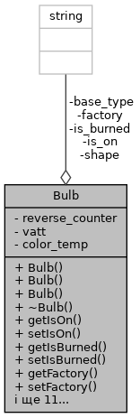

# Лабораторна робота №22. ООП. STL. Вступ до Стандартної бібліотеки шаблонів

## 1. Вимоги

### 1.1 Розробник

* Хелемендик Дмитро Олегович;
* студент групи КН-921д;
* -трав-2022.

### 1.2 Загальне завдання

Поширити реалізацію лабораторної роботи "Динамічні масиви" наступним шляхом:
	• замінити масив та CRUD (create/read/update/delete) методи роботи з ним на використання STL;
	• додати функцію сортування колекції з використанням функтора.

## 2. Опис програми

### 2.1 Функціональне призначення

Програма призначена для додавання, видалення лампочок, виводу лампочок на екран, знаходження згорівших лампочок та сортування лампочок за зворотнім лічильником. Програма працює за допомогою функцій, що задекларовані в *entity.h*, *list.hрр*, *iostream* та *vector*.

Результат зберігається у змінній *vector*.

Демонстрація знайдених результатів передбачає виконання програми у вікні консолі.

### 2.2 Опис логічної структури

За допомогою ключового слова *class* описуємо лампочку, що має 8 полів – чи ввімкнена лампочка, чи перегоріла лампочка, виробник, зворотній лічильник, ватти, температура колбору світіння, форма, тип цоколю. Розроблено структуру, вміст якої подано нижче. А також методами: конструктор(конструктор за замовчування, з аргументами та конструктор копіювання), деструктор, гетери, сетери та вивод лампочки на екран.



Також описуємо функтор як об'єкт класа з перенавантаженним оператором(), який зрівнює два цілих числа. 

Опис розроблених структур і функцій наводиться на базі результатів роботи системи автодокументування *Doxygen*.

#### Функція виводу списку

```
	void printVector(const vector<Bulb> &vector);
```

*Призначення*: друк списку на екран.

*Опис роботи*: функція друкує список на екран.

**Аргументи**:

- *vector* - посилання на вектор.

#### Функція знаходження згорівших лампочок

```
	void findBurnedBulbs(const vector<Bulb> &vector);
```

*Призначення*: знаходження згорівших лампочок.

*Опис роботи*: функція перевіряє чи є лампочки взагалі, якщо є - перевіряє на наявність згорівшої лампочки, та при наявності хоча б однієї згорівшої лампочки - друкує її.

**Аргументи**:

- *vector* - посилання на вектор.

#### Сортування лампочок за зворотнім лічильником

```
	template <class ComparisonFunctor> void sortBulbs(vector<Bulb> &vector, ComparisonFunctor c);
```

*Призначення*: відсортувати лампочки за зворотнім лічильником.

*Опис роботи*: функція сортує лампочки за зворотнім лічильником у порядку збільшення. Отримує вектор лампочок та функтор.

**Аргументи**:

- *vector* - посилання на вектор;
- *с* - функтор.

#### Основна функція

```
	int main() 
```

*Призначення*: головна функція.

*Опис роботи*: 

 - створюю 4 лампочки, використовуючи 3 реалізованних конструкторів, та створюю вектор;
 - далі додаю лампочки в вектор 4 рази у кінець функцією push_back та друкую їх за допомогою функції print;
 - потім видаляю першу лампочку шляхом виклику функції erase;
 - також знаходю згорівші лампочки за допомогою функції findBurnedBulbs;
 - нарешті, сортую лампочки за зворотнім лічильником функцією sortBulbs та друкую результат функцією print;
 - успішний код повернення з програми (0).

### Структура проекту:

```
     └── lab22
	├── doc
	│   ├── assets
	│   │   └── bulb-fields.png
	│   ├── lab22.docx
	│   ├── lab22.md
	│   └── lab22.pdf
	├── Doxyfile
	├── Makefile
	├── README.md
	├── src
	│   ├── entity.cpp
	│   ├── entity.h
	│   ├── list.hpp
	│   └── main.cpp
	└── test
		└── test.cpp
```

### 2.3 Важливі фрагменти програми

#### Функтор

```
	class compare_class {
		public:
		bool operator()(int a, int b)
		{
			return (a > b);
		}
	};
```

#### Сортування лампочок за зворотнім лічильником

```
	for (size_t i = 0; i < vector.size(); i++) {
		for (size_t j = 0; j < vector.size() - 1; j++) {
			int a = vector[j].getReverseCounter();
			int b = vector[j + 1].getReverseCounter();
			if (c(a, b)) {
				Bulb temp = vector[j];
				vector[j] = vector[j + 1];
				vector[j + 1] = temp;
			}
		}
	}
```

## 3. Варіанти використання

Для демонстрації результатів кожної задачі використовується:

- виконання програми у вікні консолі.

**Варіант використання 1**: запуск програми у вікні консолі:

- запустити програму у консолі;
- подивитись результат програми.

```
	dima@dima-VirtualBox:~/dev/programing-khelemendyk-cpp/lab22$ ./dist/main.bin 
	Adding bulbs and print them
	Bulb 1: yes, no, TOV Roga and kopyta, 100, 5, 1800, Circle, E40.
	Bulb 2: no, yes, Romashka, 21, 15, 2400, Triangle, E21.
	Bulb 3: yes, yes, TOV Pont, 152, 5, 3600, Square, E63.
	Bulb 4: no, no, Kapusta, 13, 20, 1234, Octangle, E55.
	Bulb 5: yes, no, TOV Roga and kopyta, 100, 5, 1800, Circle, E40.

	Removing bulb
	Bulb 1: no, yes, Romashka, 21, 15, 2400, Triangle, E21.
	Bulb 2: yes, yes, TOV Pont, 152, 5, 3600, Square, E63.
	Bulb 3: no, no, Kapusta, 13, 20, 1234, Octangle, E55.
	Bulb 4: yes, no, TOV Roga and kopyta, 100, 5, 1800, Circle, E40.

	Finding burnt out bulbs
	Burnt out bulb(s):
	Bulb 1: no, yes, Romashka, 21, 15, 2400, Triangle, E21.
	Bulb 2: yes, yes, TOV Pont, 152, 5, 3600, Square, E63.
	Sorting bulbs by reverse counter
	Bulb 1: no, no, Kapusta, 13, 20, 1234, Octangle, E55.
	Bulb 2: no, yes, Romashka, 21, 15, 2400, Triangle, E21.
	Bulb 3: yes, no, TOV Roga and kopyta, 100, 5, 1800, Circle, E40.
	Bulb 4: yes, yes, TOV Pont, 152, 5, 3600, Square, E63.
```

## Висновки

При виконанні даної лабораторної роботи було набуто практичного досвіду у роботі зі стандартною бібліотекою шаблонів.
